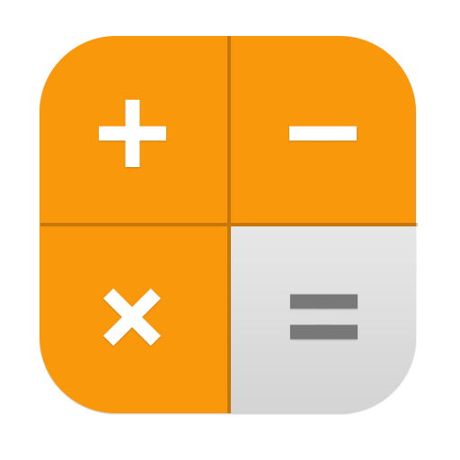

# 🎓 Advanced SGPA Calculator

A sophisticated, feature-rich SGPA (Semester Grade Point Average) calculator built with React, featuring multi-semester support, analytics, theming, and accessibility compliance.



## ✨ Features

### 📊 **Core Functionality**
- **SGPA Calculation**: Accurate semester grade point average calculation
- **Multi-Semester Support**: Manage and track multiple semesters
- **CGPA Calculation**: Automatic cumulative GPA calculation
- **Real-time Validation**: Instant feedback on grade inputs

### 💾 **Data Management**
- **Local Storage**: Automatic saving of grades and calculations
- **Calculation History**: Track all past SGPA calculations
- **Data Export**: Export as PDF, JSON, or CSV formats
- **Share Results**: Generate shareable links for results

### 📈 **Analytics Dashboard**
- **Grade Distribution**: Visual charts of your performance
- **Trend Analysis**: Track academic progress over time
- **Subject Performance**: Detailed subject-wise analysis
- **Performance Predictions**: AI-powered future performance insights

### 🎨 **Theming & Accessibility**
- **Multiple Themes**: Dark, Light, Ocean Blue, Purple Dreams
- **High Contrast Mode**: Enhanced visibility support
- **Font Size Control**: Adjustable text sizes
- **Screen Reader Support**: Full accessibility compliance
- **WCAG Compliant**: Meets web accessibility standards

### 🚀 **Advanced Features**
- **Progressive Web App**: Install on mobile devices
- **Offline Support**: Works without internet connection
- **Responsive Design**: Perfect on all screen sizes
- **Advanced Animations**: Smooth micro-interactions
- **Loading States**: Beautiful loading indicators

## 🛠️ Technologies Used

- **React 18** - Modern React with Hooks and Context API
- **Framer Motion** - Advanced animations and transitions
- **Tailwind CSS** - Utility-first CSS framework
- **Vite** - Fast build tool and development server
- **Bootstrap** - UI components and responsive utilities

## 📦 Installation

1. **Clone the repository**
   ```bash
   git clone https://github.com/yourusername/sgpa-calculator.git
   cd sgpa-calculator
   ```

2. **Install dependencies**
   ```bash
   npm install
   ```

3. **Start development server**
   ```bash
   npm run dev
   ```

4. **Build for production**
   ```bash
   npm run build
   ```

## 🚀 Usage

### Basic SGPA Calculation
1. Enter grades for each subject
2. Get real-time validation and letter grades
3. Preview your SGPA before final calculation
4. View results with beautiful animations

### Multi-Semester Management
1. Switch between different semesters
2. View completed semesters and CGPA
3. Compare performance across semesters
4. Track academic progress over time

### Analytics & Insights
1. View grade distribution charts
2. Analyze performance trends
3. Get improvement suggestions
4. See performance predictions

### Export & Share
1. Generate PDF reports
2. Export data as JSON/CSV
3. Share results via generated links
4. Print-friendly layouts

## 🎯 Project Structure

```
src/
├── components/           # React components
│   ├── reactBits/       # Reusable UI components
│   ├── Analytics/       # Analytics dashboard
│   └── ...
├── context/             # React Context providers
├── hooks/               # Custom React hooks
├── assets/              # Images and static files
└── data/                # Subject configuration
```

## 🔧 Configuration

### Subject Configuration
Edit `data/subject.js` to customize subjects:

```javascript
const subjects = {
  EpT: { 
    label: "Essential Of Physics", 
    credit: 3, 
    type: "theory", 
    outOf: 100 
  },
  // Add more subjects...
};
```

### Theme Customization
Themes can be customized in `src/context/ThemeContext.jsx`

## 📱 Mobile Support

The application is fully responsive and works perfectly on:
- 📱 Mobile phones (iOS/Android)
- 📟 Tablets
- 💻 Desktop computers
- 🖥️ Large screens

## ♿ Accessibility Features

- **Keyboard Navigation**: Full keyboard support
- **Screen Readers**: ARIA labels and semantic HTML
- **High Contrast**: Enhanced visibility modes
- **Reduced Motion**: Respects user motion preferences
- **Focus Management**: Clear focus indicators

## 🤝 Contributing

1. Fork the repository
2. Create your feature branch (`git checkout -b feature/AmazingFeature`)
3. Commit your changes (`git commit -m 'Add some AmazingFeature'`)
4. Push to the branch (`git push origin feature/AmazingFeature`)
5. Open a Pull Request

## 📄 License

This project is licensed under the MIT License - see the [LICENSE](LICENSE) file for details.

## 🙏 Acknowledgments

- React team for the amazing framework
- Framer Motion for smooth animations
- Tailwind CSS for utility-first styling
- All contributors and users of this project

## 📞 Support

If you have any questions or need help, please:
- 🐛 [Open an issue](https://github.com/yourusername/sgpa-calculator/issues)
- 💬 [Start a discussion](https://github.com/yourusername/sgpa-calculator/discussions)
- 📧 Email: your.email@example.com

---

Made with ❤️ for students everywhere 🎓